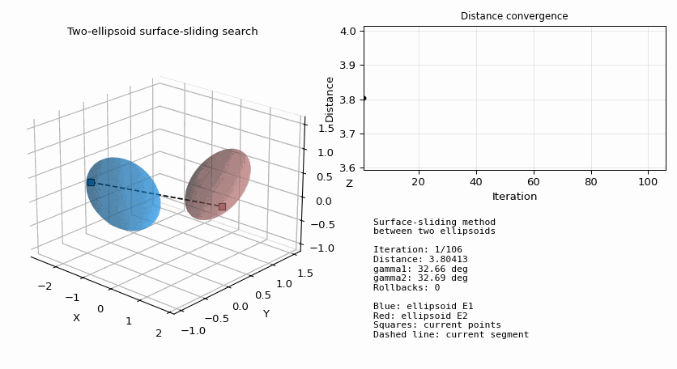
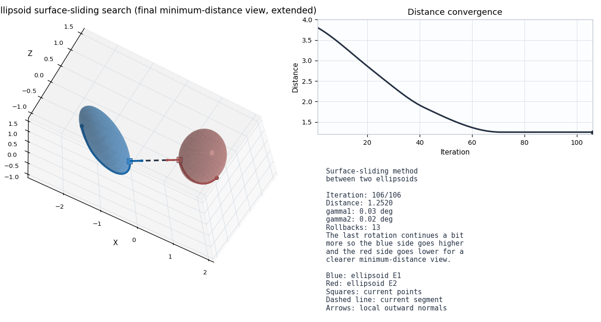

# Surface-Sliding Ellipsoid Distance





MATLAB implementation of the **surface-sliding method** for finding the minimum distance and corresponding closest surface points between two ellipsoids.

This repository accompanies the preprint:

> Dariush Amirkhani and Junfeng Zhang,  
> **Simple but not Simpler: A Surface-Sliding Method for Finding the Minimum Distance between Two Ellipsoids**,  
> arXiv:2603.22683, 2026.  
> https://arxiv.org/abs/2603.22683

The manuscript is currently under review.

---

## Repository contents

```text
surface_sliding_ellipsoid_distance.m   Main MATLAB demo/script
ellipsoid_point_local.m                Point, normal, and tangent directions on an ellipsoid
ellipsoid_param.m                      Parametric ellipsoid surface for plotting
rotation_zyx.m                         Z-Y-X rotation matrix
rotate_system.m                        Helper script for rotating the demonstration system
run_demo.m                             Simple demo launcher
extras/rotation_zy.m                   Optional Z-Y rotation helper
extras/angle_diff.m                    Optional angle-step helper
figures/                               Folder for generated example figures
```

---

## Requirements

- MATLAB
- No special toolbox is required for the basic demonstration script.
- The demo uses standard MATLAB plotting functions.

---

## Quick start

1. Download or clone this repository.
2. Open MATLAB.
3. Set the MATLAB current folder to the repository folder.
4. Run:

```matlab
run_demo
```

The script runs the surface-sliding method and displays the ellipsoid configuration, the search path, and the convergence behavior.

---

## Main script

The main script is:

```matlab
surface_sliding_ellipsoid_distance.m
```

It defines the ellipsoid parameters, initializes two surface points, runs the surface-sliding iteration, saves a log file, and plots the result.

The log file generated by the demo is:

```text
SurfaceSliding_Log.txt
```

---

## Method summary

The method keeps one point on each ellipsoid surface. At each iteration, the line segment connecting the two points is projected onto the local tangent directions of both ellipsoids. The two surface points then slide along the surfaces until the connecting segment becomes aligned with the local outward normal directions. At convergence, the distance between the two surface points gives the minimum separation distance.

---

## Suggested citation

If you use this code, please cite the accompanying paper:

```bibtex
@article{AmirkhaniZhang2026SurfaceSliding,
  title   = {Simple but not Simpler: A Surface-Sliding Method for Finding the Minimum Distance between Two Ellipsoids},
  author  = {Amirkhani, Dariush and Zhang, Junfeng},
  journal = {arXiv preprint arXiv:2603.22683},
  year    = {2026},
  url     = {https://arxiv.org/abs/2603.22683}
}
```

---

## Authors

- Dariush Amirkhani  
- Junfeng Zhang  

School of Engineering and Computer Science, Laurentian University, Sudbury, Ontario, Canada.

---

## License

This repository is distributed under the MIT License. Please confirm the license choice with all co-authors before public release.
